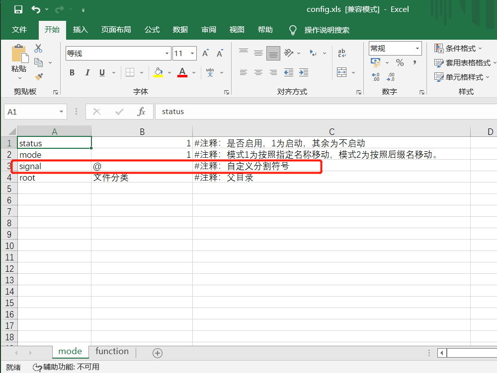
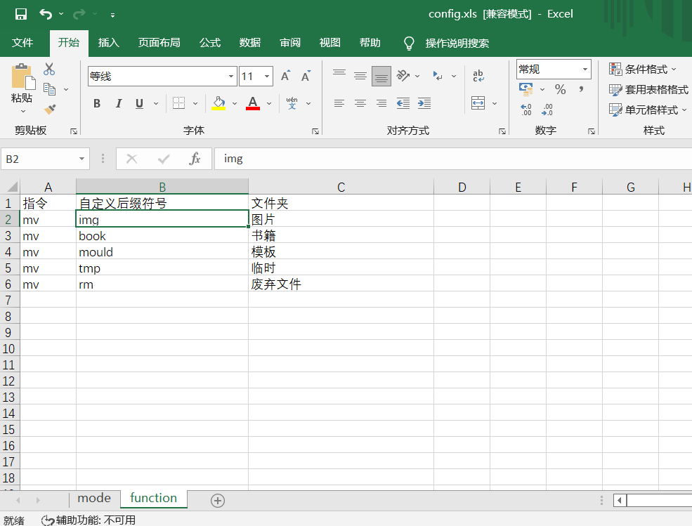

# 桌面文件分类器
## 简介
能将文件按照指定的想法进行分类，只需要配置config.xls配置，并给文件名加个指定后缀即可实现分类。帮助不勤于清理桌面的恢复干净整洁的桌面，当然只要需要分类的地方都可以采用此程序。

## python运行必备
需要按照的库xlrd，xlwt
```
pip install xlrd
pip install xlwt
```

运行分类器的命令
```
python python classify.py
```

## 简单展示 v1.2.0	(增添移除自定义后缀功能)
如下图是运行文件分类器前的分类效果

如下图是运行完文件分类器后的分类效果

配置文件中的内容


如下图是运行移除自定义后缀前的效果

如下图是运行移除自定义后缀后的效果

配置文件中的内容


配置中的explain表为解释说明表，用于查阅配置的含义


## 使用方式
如下图，在创建文件的时候在名称最后添加指定符号如“@img”，“@book”（可在配置文件中轻松自定义）

一旦运行文件分类器，它们将按照config.xls配置文件中的配置进行分类
如以“@img”结尾的将被移动到“图片”文件夹，以“@book”结尾的将被移动到“书籍”文件夹


## 自定义配置文件 
### 分割符号
目前是基础功能，因此只用了signal，代表分割的符号，如上面“@img”，这里的“@”就是分割符号。可以自定义改成符号如“#”，则文件起名就起为“#img”

注意哦，文件不能包含这些字符，因此配置文件的signal字段不能为这些字符


### 分割符号后缀
目前只有mv指令，因此不需要改动。只需要自定义“自定义后缀符号”和“文件夹”列

如想将小说也分到一个文件夹，则可以“read”为后缀，文件夹为“小说”

这样只要以“@read”结尾的都会被分类到“小说”文件夹中

执行前

执行后


## 历史版本
## 简单展示 v1.0.0	(只能移动文件)
如下图是运行文件分类器前的分类效果

如下图是运行完文件分类器后的分类效果


## 简单展示 v1.1.0	(能移动文件和目录及其目录下的文件)
如下图是运行文件分类器前的分类效果

如下图是运行完文件分类器后的分类效果

配置文件中的内容
